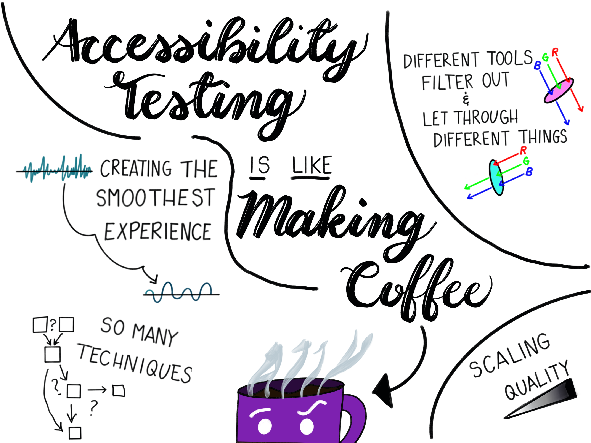
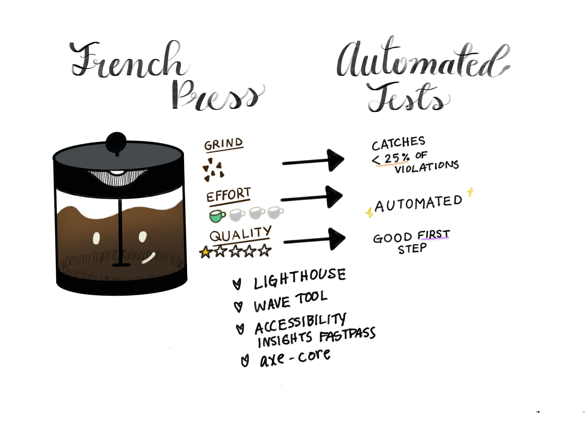
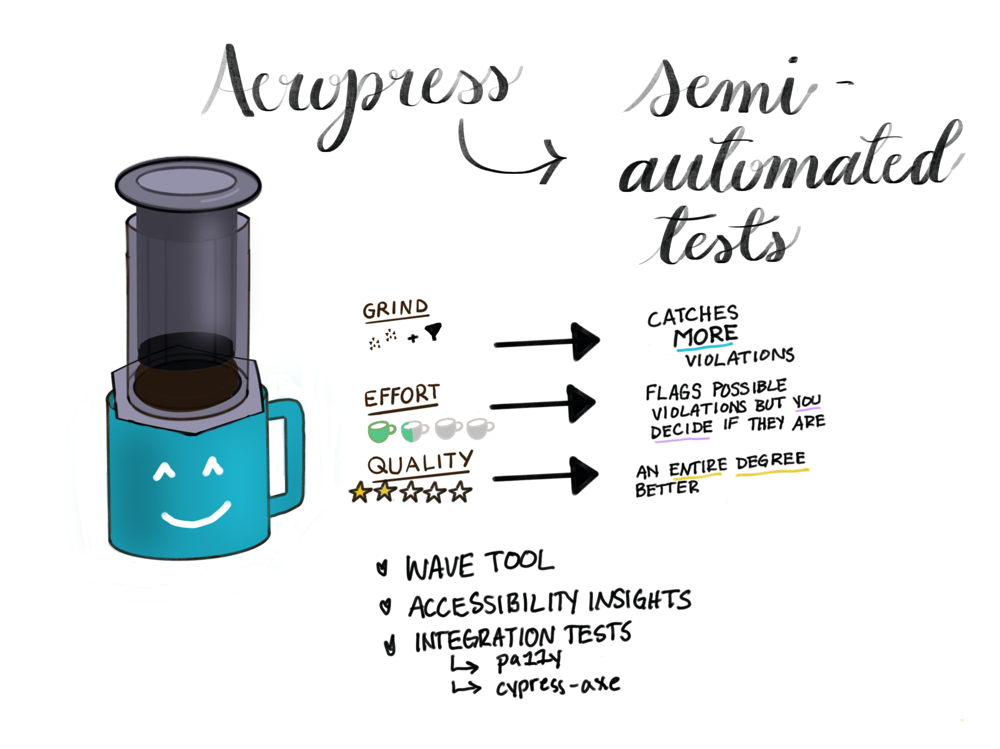
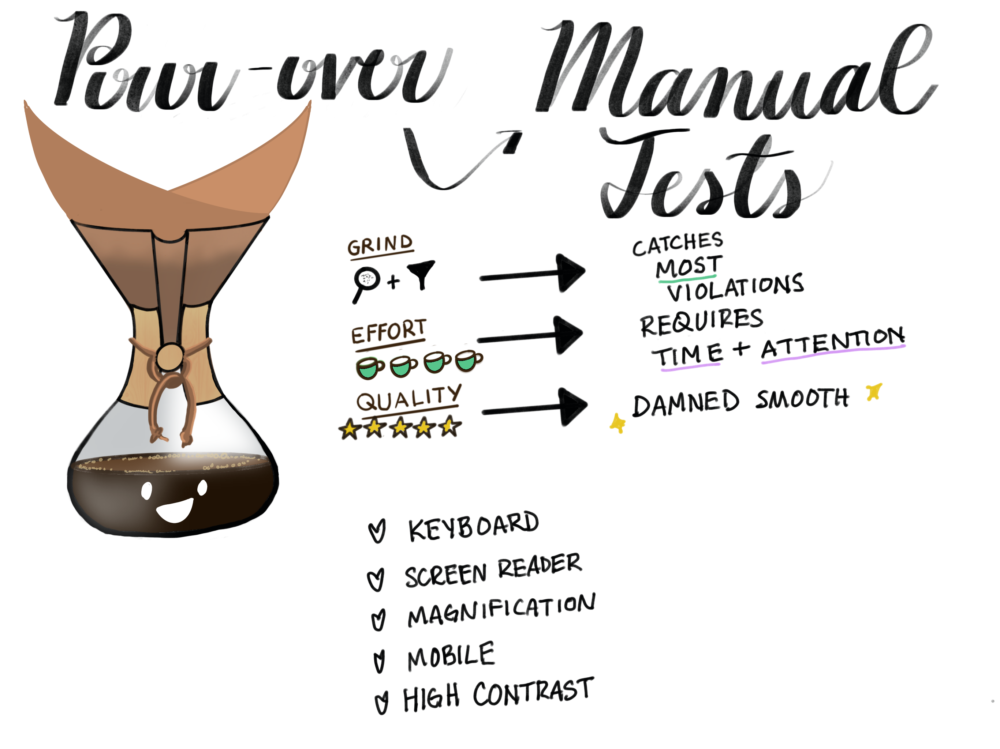
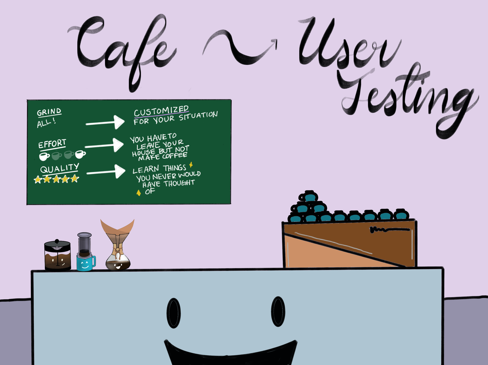

import { SEO, Callout } from "../../"

<SEO
  title="A11y Testing Is Like Making Coffee"
  description="There are many different ways to make coffee, with different results. There are also different ways to test a11y, with different results!"
/>

# A11y Testing Is Like Making Coffee

<Callout>

This was [originally written and published](https://madalyn.dev/blog/a11y-testing-coffee/) by a friend and colleague, [Madalyn Parker](https://twitter.com/madalynrose/). Our ideas have percolated together (clearly!) and we thought they belonged together on this site!

</Callout>

## Some Background

I had the privilege of creating course material to teach accessibility testing for work this past quarter.

I agonized over what to include, how to deliver it, how to make it approachable. I decided that I wanted to center everything around **tools** and **processes**, teaching about what sorts of violations each are intended for, what they catch, and what they miss.

I envisioned handing my trainees funnels that were narrower and narrower, allowing increasingly smaller violations pass through.

Tooling overwhelm is real when it comes to anything, but I find that this is particularly true when those tools determine whether something is safe or legal. I aim to minimize hesitation to choose a tool and do the testing at all for fear of choosing the wrong one. And for that, I sat with the concepts and played with metaphors until I found something that fit.

And I arrived at:

I could have used any metaphor that involves scaling quality of experience. I could talk about audio or image formats, but I chose coffee because it's tangible, because I love coffee, and because I think most people have a frame of reference for it.

In accessibility testing, and when making coffee, we are shooting for the _smoothest_ experience. We want to get to the **essence** of the thing we're making. We want to filter out the grit and bitterness and include everything that makes our final product enjoyable.

## Coffee Methods

So let's talk about coffee! There are _a lot_ of ways to make coffee and people have _a lot_ of opinions about which way is The Best Way. The thing is, the best way is whatever makes the experience best for whoever is drinking the coffee.

I make my coffee one way, my husband makes it his way. And we both order entirely differently if we go out and have someone else make us coffee.

There are many different types of coffee-making implements and each spits out slightly different coffee.

Some things that can affect the quality of coffee are:

- how finely the coffee beans are ground (more oils make it into the final product with a finer grind, meaning you get nuanced flavor)
- filtration system (paper filters catch and spread those oils)
- time spent on the process

I've split accessibility testing tools into four categories, so I'll talk about four ways to make coffee.

### French Press === Automated Testing

French press coffee is nice because:

- it's fairly hands-off (set a timer, walk away, come back!)
- uses one pot and no extra filter, making cleanup a breeze!
- uses a course grind (quick to grind, no fancy tools necessary!)

However it also has some draw backs:

- can get gritty or sludgey
- unfiltered coffee tends to be on the bitter side and misses nuanced flavors

Like the French Press, automated testing lets grit through. Automated testing can only reliably identify a small subset of accessibility violations (I've heard numbers between 10% and 30%). For some people, the violations caught by automated testing will give them a good experience on your site. For others, it won't find even half of the violations that render it inaccessible. Automated testing is also relatively quick and hands off, but it only gains you so much.

Some wonderful automated tools include:

- [axe](https://www.deque.com/axe/) - this is what sits under _most_ automated tooling. You can leverage it directly in your code using the [axe-core](https://github.com/dequelabs/axe-core) API or use their browser extensions to run on rendered pages.
- [Lighthouse](https://developers.google.com/web/tools/lighthouse) includes accessibility auditing and runs axe. It's shipped right in Chrome DevTools and also has a [CI integration](https://github.com/GoogleChrome/lighthouse-ci/blob/master/docs/getting-started.md) you can add to your pipeline.
- [Accessibility Insights](https://accessibilityinsights.io/) is my all time favorite accessibility testing tool. It's built by Microsoft and has versions for Android, web, and Windows. I'll be talking about their Chrome extension, which also uses axe, but all of these are top notch amazing for auditing. There are a lot of moving pieces to this tool, and its "Fastpass" feature fits the "French Press" bill.
- [WAVE Web Accessibility Evaluation Tool](https://wave.webaim.org/) is created by [WebAIM](https://webaim.org/), which is an incredible organization responsible for a lot of [accessibility usage and demographic data](https://webaim.org/projects/), [approachable documentation](https://webaim.org/standards/wcag/checklist), and [a variety of services for education and evaluation](https://webaim.org/services/). They have their own API and this tool can either be run from their website or as a browser extension.

### Aeropress === Semi-automated Testing

One step up from the French Press is the Aeropress.

Aeropress coffee is nice because:

- it's super quick (the longest step is waiting for water to boil!)
- it uses a filter (get some of those good coffee bean oils without much effort)
- uses a finer grind (again with the oils!)
- customizable (can make "espresso" or cold brew with it)

But it also has some draw backs:

- can still get sludgey
- only makes one cup at a time
- takes physical strength
- finicky

Like the Aeropress improves upon French Press coffee by giving you a smoother brew with more nuance, semi-automated testing will catch more accessibility violations. But also like the Aeropress, it'll take some extra work from you.
These tools flag _possible_ violations and highlight features that _potentially_ create issues. They require you to use your judgement to decide what is a bug and what is indeed a feature. I'll also include integration tests in this category, as you have to simulate user interaction in order to catch violations.

These tools include:

- [WAVE Tool](https://wave.webaim.org/) (again!) because:
  - its "Alerts" section flags _potential_ violations
  - it surfaces all elements using [WAI-ARIA](https://www.w3.org/WAI/standards-guidelines/aria/), which needs to be used mindfully and intentionally and should always be looked at critically
  - it shows page structure with Headings and Landmarks but leaves it up to you to determine whether they meet standards
- [Accessibility Insights](https://accessibilityinsights.io/) (also again!) because:
  - its "Tab Stops" feature requires you to actually tab through the page manually to verify that tab order follows both reading order and DOM order
  - its "Ad hoc tools" surface structure similarly to the WAVE tool
- Integration Tests can be used to run a11y checks, interact with the UI, and run them again, verify that focus is where it should be (e.g. is it moved to the modal when the modal is opened?)
  - [pa11y](https://github.com/pa11y/pa11y)
  - [cypress-axe](https://github.com/avanslaars/cypress-axe)

### Pour Over === Manual Testing

The Pour Over is the generally accepted Best Way to Make Smooth Coffee. There are a lot of variables to get right (weight, temperature, humidity, time, technique), but once you've perfected the art you're left with a bright cup of very smooth Joe. Want to use a finer grind? It's going to take more time. Pour Over coffee involves hovering over your Chemex or other implement and drizzle boiling water in a circular motion in order to lengthen the "blooming" process, allowing for trapped gases, that might make the coffee harsh, to escape.

- truly the smoothest brew
- bright flavors and highlighted fruity notes

Trade Offs:

- isn't as bold as the coffee you would get from a French Press
- requires **time** and **attention**
- easy to mess up

With manual testing, you have to roll up your sleeves and spend time with your product. You have to be present and interact with it. But you'll catch things that nothing else will. I cannot stress this enough: **you cannot determine if your site is accessible without manual testing**.

Manual testing means adopting workflows that disabled people use and determining if your site is usable. Practice makes approximate here; you'll never use a screen reader the way someone who relies on one does. And screen reader users are not a monolith anyhow. Data shows that most people who regularly use assistive technology customize it to suit their very specific needs.

So these tools are:

- navigating with your keyboard
- using a screen reader
- turning your screen magnification way up (300%+)
- using a site with audio muted
- verifying that the [prefers reduced motion](https://developer.mozilla.org/en-US/docs/Web/CSS/@media/prefers-reduced-motion) setting is respected

I will also add [Accessibility Insights](https://accessibilityinsights.io/) into this list because it will walk you, step-by-step, through an [accessibility audit](https://accessibilityinsights.io/docs/en/web/getstarted/assessment). It provides documentation and all the scaffolding you need to make sure that a site is compliant. And that is so powerful!

However, these workflows are difficult to adopt and attempt if you don't understand the use cases behind them or what success criteria are. And that's why none of these methods or tools are as good as user testing.

### Going to a Cafe === User Testing

User testing means you get to understand and witness the barriers to access that disabled people encounter when they use your site. You'll be able to make note of their workflows so you can approximate them in future manual tests. We cannot talk about accessibility if we don't also talk about disability. You'll know you have an accessible site when you know that disabled people can use it and have a good experience.

And this is going to a cafe. Can I make my Aeropress every morning and be happy with my coffee? Sure. But if I go to a cafe they have all the ways to make coffee and many I've never even heard of. They can make an Oat Milk Latte with Cayenne for my husband, a Pour Over for my friend, and a Cafe Au Lait for me. We don't have to make the coffee but we do have to leave the house. That extra effort is worth it when everyone gets exactly what they want.

There are many accessibility testing services like [Fable](https://www.makeitfable.com/) that will connect you with disabled people for on-demand user testing and research.

## Closing

I hope this metaphor helped break down how you might use different tools in accessibility testing. Some tools can cover a lot of ground.

I have a blog post on [how to get set up for manual accessibility testing](https://madalyn.dev/blog/manual-a11y-testing-setup/) and another on [using a screen reader and the keyboard](https://madalyn.dev/blog/5-things-a11y-keyboard-testing/) that will hopefully make manual testing even more approachable.

I think overwhelm keeps people from choosing their tools and trying them out. They'll either choose instant coffee as the easier option (no testing) or go straight to the cafe (hire someone else). I'd like to advocate for trying some new tools out and seeing what kind of experience you can create with them.
